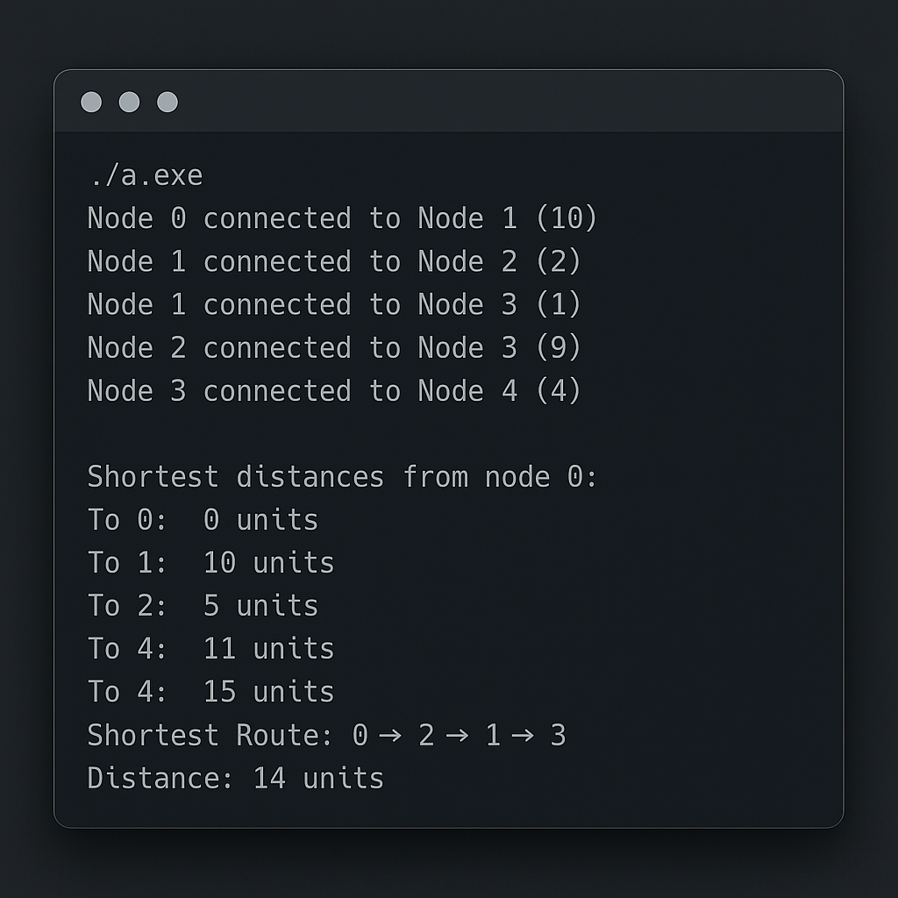

# 🚗 Alternative Routes in Road Networks

This C++ project simulates route optimization in a road network using **Dijkstra's Algorithm**.

## 📌 Features
- Graph-based road modeling
- Shortest route calculation from any node
- Easy to extend into a traffic simulator
- Educational demo with clean, readable code

## 📸 Output

## ⚙️ Tech Stack
- C++
- STL (Vectors, Priority Queue)

## 🧠 Concepts Used
- Graphs
- Dijkstra’s Algorithm
- Adjacency List
- Priority Queue

## 🗂 Files
- `main.cpp`: Core implementation
- `screenshot.png`: Sample output
